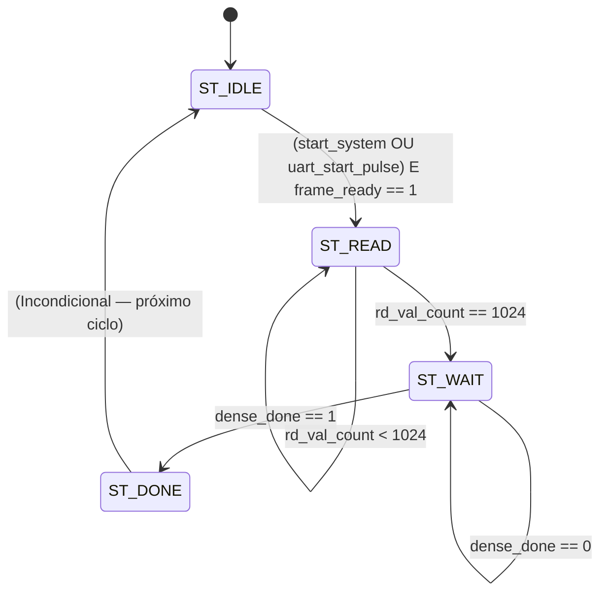
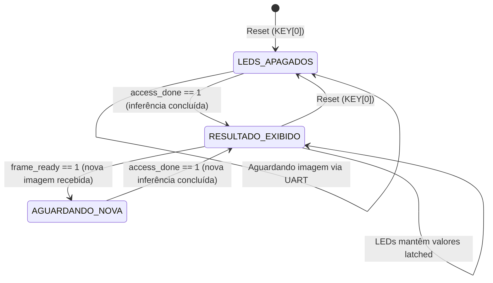

# Máquinas de Estados Finitas (FSMs) — Tiny-CNN FPGA (19 Classes)

Este documento detalha o funcionamento das duas Máquinas de Estados Finitas que governam o fluxo de inferência da arquitetura Tiny-CNN implementada na FPGA DE2-115. O sistema é composto por dois módulos hierárquicos, cada qual com sua própria lógica de controle:

1. **FSM de Inferência** — residente no módulo `cnn_top.v`, orquestra o pipeline computacional da rede neural.
2. **Lógica de Captura e Exibição** — residente no módulo `fpga_top_de2115.v`, gerencia a interface física com os periféricos da placa (LEDs, botões).

> Para a descrição detalhada de cada módulo e do fluxo de dados, ver [`pipeline.md`](pipeline.md).

---

## 1. FSM de Inferência (`cnn_top.v`)

Esta é a máquina principal do sistema. Ela controla a transferência da imagem do framebuffer interno para o pipeline da CNN, aguarda a propagação dos dados por todas as camadas computacionais e sinaliza a conclusão do processo.

### 1.1 Diagrama de Estados

### 1.2 Mecanismo de Disparo Automático via UART

Antes da FSM principal entrar em ação, existe uma lógica combinacional e sequencial que monitora a recepção de bytes via UART e gera o pulso de disparo automaticamente. O fluxo é:

1. O módulo `uart_rx` (instanciado dentro do `cnn_top`) decodifica cada byte serial recebido pelo pino `rx_pin` e emite um pulso `uart_valid` de 1 ciclo por byte.
2. Um sinal combinacional `uart_wr_en_comb` é gerado quando `uart_valid` está ativo, a FSM está em `ST_IDLE`, `frame_ready` está baixo e não há frame pendente. Este sinal habilita a escrita imediata do byte no framebuffer.
3. Um contador de endereço `uart_wr_addr` é incrementado a cada escrita. Quando o endereço atinge `1023` (último pixel da imagem 32×32), a flag `uart_frame_pending` é ativada.
4. No ciclo seguinte, quando `frame_ready` sobe para `1` (o framebuffer detectou a escrita no endereço 1023), a lógica gera `uart_start_pulse`, que é combinado via OR com `start_system` para formar `start_system_int`.
5. O sinal `start_system_int` é o gatilho efetivo que a FSM observa para iniciar a transição de `ST_IDLE` para `ST_READ`.

Portanto, a inferência é disparada automaticamente assim que os 1024 bytes da imagem são recebidos pela UART, sem necessidade de intervenção manual.

### 1.3 Explicação Detalhada dos Estados

#### `ST_IDLE` (Estado de Repouso)
**Descrição:** Estado inicial do sistema, acessado após reset ou após a conclusão de uma inferência anterior. A FSM permanece inerte aguardando um estímulo de disparo.

**Ações do Estado:**
- Mantém o barramento de leitura do framebuffer desabilitado (`fb_rd_en = 0`).
- Zera os contadores de requisições de leitura (`rd_req_count = 0`) e o contador de dados válidos recebidos (`rd_val_count = 0`).
- Zera o endereço da camada densa (`dense_addr = 0`).
- Permanece monitorando simultaneamente dois possíveis sinais de disparo:
  - `uart_start_pulse`: gerado automaticamente pela lógica UART após recepção de 1024 bytes.
  - `start_system`: acionado externamente (ex: botão KEY[1] no wrapper `fpga_top_de2115.v`).

**Condição de Transição (`ST_IDLE` ➔ `ST_READ`):**
- Ocorre quando `start_system_int == 1` (qualquer um dos dois sinais de disparo) **E** `frame_ready == 1` (o framebuffer confirma que possui uma imagem completa).
- Ao transicionar, emite um pulso `frame_clear = 1` que reseta a flag `frame_ready` do framebuffer, consumindo a imagem e prevenindo re-disparos espúrios.

---

#### `ST_READ` (Estado de Leitura e Alimentação)
**Descrição:** Neste estado, a FSM drena sequencialmente toda a imagem armazenada no framebuffer e injeta os pixels, um por ciclo de clock, na entrada do pipeline da CNN (especificamente, no Line Buffer).

**Ações do Estado:**
- Habilita a porta de leitura do framebuffer (`fb_rd_en = 1`).
- Incrementa progressivamente o endereço de leitura `fb_rd_addr` de `0` até `1023`, avançando um endereço por ciclo de clock, através do contador `rd_req_count`.
- Após `rd_req_count` atingir `1024`, desabilita a requisição de leitura (`fb_rd_en = 0`), pois todas as requisições já foram emitidas.
- Paralelamente, o contador `rd_val_count` monitora quantos dados válidos foram efetivamente entregues ao Line Buffer (contabiliza ciclos onde `fb_rd_en_d` — versão atrasada em 1 ciclo do `fb_rd_en` — está ativo).

**Condição de Transição (`ST_READ` ➔ `ST_WAIT`):**
- Ocorre quando `rd_val_count == 1024`, indicando que todos os 1024 pixels foram fisicamente transferidos da memória para o pipeline. A FSM desabilita definitivamente `fb_rd_en` e avança.

---

#### `ST_WAIT` (Estado de Espera pelo Pipeline)
**Descrição:** Todos os pixels já saíram do framebuffer, mas ainda estão se propagando pelas camadas internas do hardware. Os dados viajam sequencialmente pelo Line Buffer, Módulos MAC de Convolução, FIFOs do Max Pooling, Flatten e acumuladores da Camada Densa. Cada estágio introduz sua própria latência.

**Ações do Estado:**
- Mantém o barramento de leitura desabilitado (`fb_rd_en = 0`).
- Monitora passivamente o sinal `dense_done`, que será emitido pela camada densa quando o último dos 900 elementos achatados for processado e os **19 scores de classe** estiverem calculados.
- Durante este período, o endereço `dense_addr` é incrementado automaticamente a cada pulso de `flat_valid` (controlado fora da FSM, na lógica combinacional do `cnn_top`), percorrendo os 900 endereços da ROM de pesos densos.

**Condição de Transição (`ST_WAIT` ➔ `ST_DONE`):**
- Ocorre quando `dense_done == 1`. Neste instante, os 19 scores brutos (logits) estão estáveis nas saídas da camada densa, e o módulo Argmax já computou `class_id`, `unknown` e `max_score`.

---

#### `ST_DONE` (Estado de Sinalização de Fim)
**Descrição:** Estado efêmero de exatamente um ciclo de clock. Serve exclusivamente para notificar o wrapper externo de que o resultado da inferência está pronto e estável.

**Ações do Estado:**
- Ativa o sinal `access_done = 1` por um único ciclo.
- Neste exato ciclo, as seguintes portas de saída do `cnn_top` contêm valores válidos e podem ser capturados:
  - `class_id[4:0]`: índice da classe predita (0 = Desconhecido, 1–18 para membros).
  - `unknown`: flag booleano indicando se `class_id` é 0 (classe de rejeição).
  - `final_result[15:0]`: valor numérico do maior score em formato Q2.14.

**Condição de Transição (`ST_DONE` ➔ `ST_IDLE`):**
- Incondicional. No ciclo de clock seguinte, a FSM retorna automaticamente para `ST_IDLE`, pronta para receber uma nova imagem e executar uma nova inferência.

---

## 2. Lógica de Captura dos LEDs (`fpga_top_de2115.v`)

O módulo wrapper `fpga_top_de2115.v` não possui uma FSM convencional com estados nomeados. Em vez disso, implementa um registrador de captura (latch) que preserva o resultado da inferência nos LEDs da placa até a próxima inferência ou reset.

### 2.1 Diagrama de Comportamento

### 2.2 Mapeamento dos LEDs

| LED | Sinal Latched | Significado |
|-----|---------------|-------------|
| `LEDG[4:0]` | `class_id[4:0]` | Classe predita em binário (0 = Desconhecido; 1–18 = membro) |
| `LEDG[5]` | `debug_frame_nonzero` | Frame recebido com pixels não-nulos |
| `LEDG[6]` | `1` quando concluído | Inferência concluída com sucesso |
| `LEDG[7]` | `unknown` | Predição foi a classe 0 (Desconhecido) |

**Comportamento detalhado:**
- **Ao reset (`KEY[0]` pressionado):** Todos os LEDs são apagados (`LEDG = 8'b00000000`).
- **Ao receber `access_done == 1`:** O registrador captura instantaneamente `class_id[4:0]`, `debug_frame_nonzero` e `unknown`, acende `LEDG[6]` para confirmar a conclusão, e mantém estes valores indefinidamente.
- **Ao receber `frame_ready == 1` (nova imagem chegou):** O `LEDG[6]` é apagado, sinalizando visualmente que uma nova inferência está em andamento. Os demais LEDs mantêm temporariamente os valores da inferência anterior.
- **Quando a nova inferência conclui:** Os LEDs são atualizados com os novos valores.

### 2.3 Sincronização do Botão KEY[1]

O botão `KEY[1]` da DE2-115 é utilizado como alternativa de disparo manual da inferência. Embora o fluxo principal seja automático (a UART dispara a inferência ao completar 1024 bytes), o `KEY[1]` permite re-disparar manualmente caso necessário.

O sinal do botão passa por um pipeline de sincronização de 3 estágios:
1. `key1_sync_1 ← KEY[1]` (primeiro flip-flop de sincronização)
2. `key1_sync_2 ← key1_sync_1` (segundo flip-flop — sinal estável)
3. `key1_prev ← key1_sync_2` (registrador de borda anterior)

O pulso `key1_pressed` é gerado pela expressão `key1_prev & ~key1_sync_2`, que detecta a borda de descida (momento em que o botão active-low é pressionado) e produz um pulso de exatamente 1 ciclo de clock.
