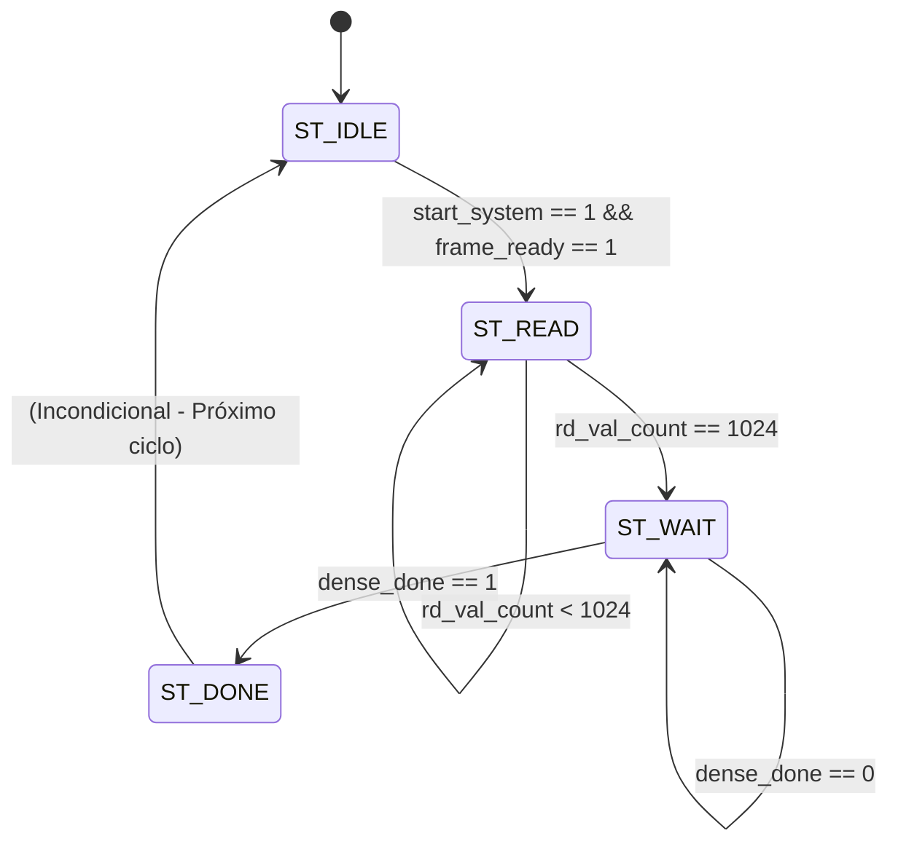

# Máquina de Estados Finita (FSM) - cnn_top.v

Este documento detalha o funcionamento da Máquina de Estados Finita (FSM) implementada no módulo superior (`cnn_top.v`). Esta máquina é responsável por orquestrar todo o fluxo de inferência da arquitetura Tiny-CNN, garantindo a inicialização correta das leituras e sincronizando os tempos das camadas profundas até a finalização do processo.

## Diagrama de Estados (Visual)

Abaixo encontra-se a representação visual dos estados e as lógicas de transição entre eles.

---

## Explicação Detalhada dos Estados e Transições

A máquina de estados possui 4 estados fundamentais, descritos sequencialmente a seguir:

### 1. `ST_IDLE` (Estado de Repouso)
**Descrição:** É o estado inicial do sistema (acessado através de reset) e o estado de espera por novas solicitações. 
**Ações do Estado:**
- Mantém o barramento de leitura de memória do framebuffer inativo (`fb_rd_en = 0`).
- Zera completamente os contadores de requisições de leitura (`rd_req_count`) e o ponteiro de contagem de dados válidos lidos (`rd_val_count`).
- A FSM aguarda de maneira inerte até que dois eventos externos se confirmem.

**Condição de Transição (`ST_IDLE` ➔ `ST_READ`):**
- A transição só ocorre se o sinal `start_system` for cravado em nível alto **E** a flag `frame_ready` for verdadeira (indicando que a porta de entrada finalizou a escrita dos 1024 pixels no framebuffer). Ao transicionar, ela dispara um pulso `frame_clear` para consumir/resetar a flag da memória.

### 2. `ST_READ` (Estado de Leitura e Alimentação)
**Descrição:** Neste estado, a FSM drena agressivamente a imagem previamente armazenada no framebuffer e injeta os pixels um a um na entrada da pipeline da CNN (mais especificamente, dentro do Line Buffer).
**Ações do Estado:**
- Habilita a porta de leitura do framebuffer (`fb_rd_en = 1`).
- Assinala os endereços de `0` até `1023` progressivamente no barramento `fb_rd_addr` a cada ciclo de clock.
- Paralelamente à requisição, monitora se o contador de dados "válidos" recebidos do buffer (`rd_val_count`) já preencheu a imagem inteira.

**Condição de Transição (`ST_READ` ➔ `ST_WAIT`):**
- Assim que o contador de pixels validados registrar `1024` elementos lidos (`rd_val_count == 1024`), a FSM compreende que a imagem toda foi transferida para dentro da rede neural, cortando o sinal de leitura e evoluindo para o próximo estado.

### 3. `ST_WAIT` (Estado de Espera pelo Pipeline)
**Descrição:** Embora toda a imagem já tenha saído do Framebuffer, ela ainda está se propagando pelas camadas internas do hardware (viajando assincronamente através do Line Buffer, Módulos MAC, FIFOs do Max Pooling, Flatten e acumuladores da Camada Densa). 
**Ações do Estado:**
- Conserva o barramento de leitura de memória desabilitado (`fb_rd_en = 0`), poupando energia e acessos.
- Aguarda pacientemente monitorando o fio da camada inferior chamado `dense_done`.

**Condição de Transição (`ST_WAIT` ➔ `ST_DONE`):**
- Quando o último pixel atravessa todas as camadas, é esvaziado pelo Flatten e atinge o acumulador final na camada densa, este módulo processa o cálculo final e emite o pulso `dense_done = 1`. Ao enxergar este pulso, a FSM detecta que todos os escores brutos (logits) e a decisão Argmax estão instáveis e prontos. A máquina salta para a finalização.

### 4. `ST_DONE` (Estado de Sinalização de Fim)
**Descrição:** Estado fugaz de um único ciclo de clock utilizado apenas para avisar o mundo externo que a resposta matemática está validada e pronta para o consumo.
**Ações do Estado:**
- Seta o sinal principal `access_done = 1`. 
- Isso permite que qualquer dispositivo ou interface externa observando o sistema obtenha os valores corretos das portas finais `final_result`, `class_id` e `unknown`.

**Condição de Transição (`ST_DONE` ➔ `ST_IDLE`):**
- A máquina não depende de confirmação externa de recebimento de pacote (ausência de handshake). Logo no ciclo de clock subsequente, ela regride automática e incondicionalmente para o `ST_IDLE`, reiniciando o ciclo da FSM e mantendo a arquitetura pronta para um próximo estímulo.
