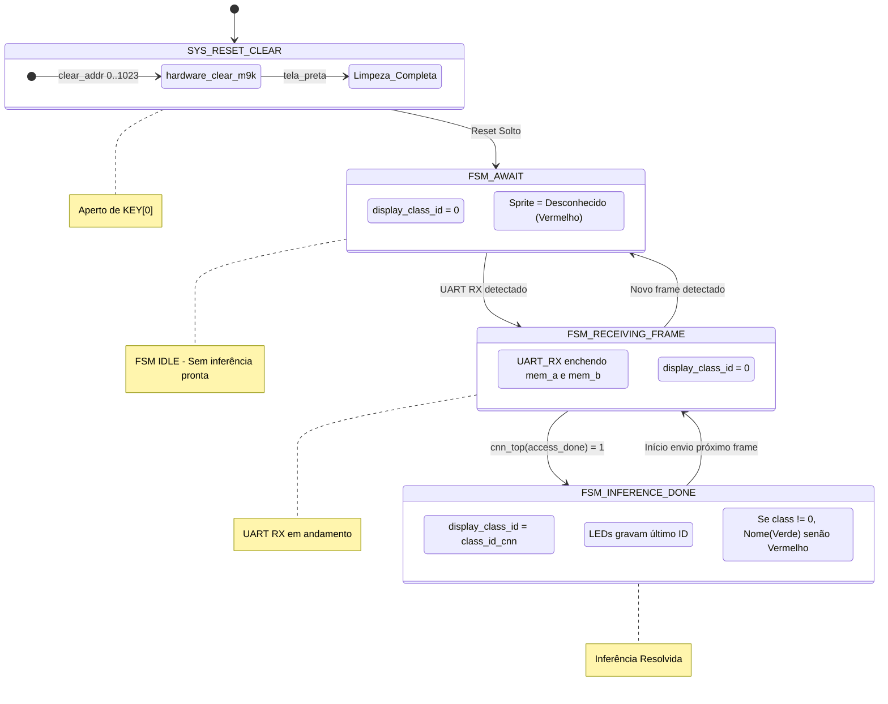
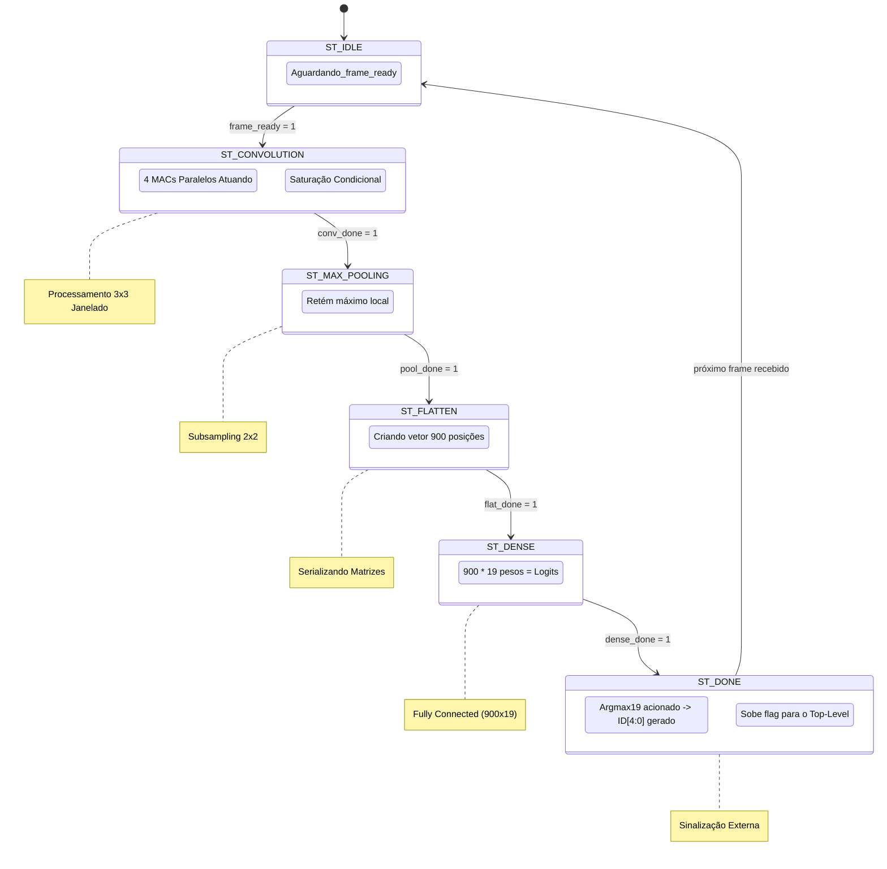

# Documentação Detalhada do Sistema: Tiny-CNN FPGA + VGA

Esta documentação disseca minuciosamente a arquitetura unificada da fechadura biométrica implementada na FPGA DE2-115. O sistema envolve captura e pré-processamento via Python, transmissão UART, inferência por hardware dedicado (CNN) e renderização gráfica VGA.

---

## 1. Módulos de Hardware (Verilog)

A inteligência do hardware reside na pasta `modulos_verilog` e a interface gráfica na `vga_artefato`. O projeto foi codificado puramente em Verilog (RTL), utilizando instâncias diretas e memórias BRAM (M9K).

### 1.1 Orquestradores Principais

#### `fpga_top_unified.v` (Top-Level Global)
- **Função Geral:** É a entidade de nível mais alto (top-level) que une o pipeline da CNN com o controlador de display VGA.
- **Funcionamento Específico:** Responsável por rotear os clocks, fazer o *Clock Domain Crossing* (CDC) e instanciar todos os sub-módulos. Implementa uma FSM orquestradora nativa que avalia os resultados entregues pela rede neural. A FSM atrela a constante `display_class_id` a `0` ("Desconhecido") ao inicializar ou quando um novo frame está sendo recebido, e a atualiza com o ID detectado (1–18) tão logo a `cnn_top` levante a *flag* de `access_done`.
- **Parâmetros/Componentes:** 
  - Gera sinal de video escalado `12x` (de 32x32 para 384x384). O algoritmo usa `x * 5462 >> 16` como método otimizado (multiplicação recíproca) para divisão inteira por 12 sem instanciar divisores de hardware pesados.
  - Sincroniza as saídas VGA aos domínios de clock adequados utilizando buffers (`VGA_R`, `VGA_G`, `VGA_B`).

#### `cnn_top.v` (Orquestrador da CNN)
- **Função Geral:** Roteador e FSM do processamento das camadas neurais.
- **Funcionamento Específico:** Funciona a 50 MHz. Ao receber o sinal `frame_ready` (buffer preenchido), transita pelos estados de camada: `IDLE` → `CONV` → `MAXPOOL` → `FLATTEN` → `DENSE` → `DONE`. Garante que uma camada só inicie quando a dependente anterior estiver sinalizada (ex: o `pool_done` habilita o Flatten, que por sua vez habilita o estado Dense).
- **Parâmetros/Entradas:** `class_id[4:0]`, `access_done`, `frame_ready`.

### 1.2 Recepção e Memória

#### `uart_rx.v`
- **Função Geral:** Receptor de comunicação serial assíncrona.
- **Funcionamento Específico:** Amostra a linha `RXD` em 115200 baud. Utiliza super-amostragem clássica para mitigar ruído e alinhar com o centro do bit. Ao montar 8 bits lidos do barramento, levanta a *flag* `rx_done`.
- **Parâmetros:** Baseado em clock de 50 MHz (`CLK_FREQ`) e baud de 115200 (`BAUD_RATE`), possuindo o registrador derivado genérico.

#### `framebuffer_32x32.v`
- **Função Geral:** Memória BRAM Dupla Porta (Dual-Port M9K) armazenando os 1024 bytes de vídeo em tons de cinza.
- **Funcionamento Específico:** Para mitigar *Resource Heavy* RAMs de 3 portas, utiliza espelhamento: dois arrays BRAM (`mem_a` e `mem_b`) são escritos simultaneamente pelo UART. A `mem_a` possui leitura dedicada para a inferência CNN (50 MHz) e a `mem_b` leitura dedicada ao DAC do VGA (25 MHz). 
- **Lógica de Clear:** Incorpora um contador "hardware clear" (`clear_addr` de 0 a 1023) acionado por pulso no `rst` assíncrono (KEY[0]). Ele preenche ambos os M9K com `0x00`, forçando uma tela preta imediatamente na interface VGA.

### 1.3 Pipeline da Rede Neural Convolucional

#### `line_buffer_32x32.v`
- **Função Geral:** Buffering contínuo criando as matrizes 3x3 para convolução a partir do fluxo linear 1D da imagem 32x32.
- **Funcionamento Específico:** Armazena duas linhas inteiras. Quando processa a linha 3, disponibiliza um janelamento 3x3 no espaço simultaneamente, alimentando as unidades MAC a cada pulso de clock.

#### `convolucao_mac.v`
- **Função Geral:** Núcleo aritmético combinacional de Multiplicação-Acumulação e ativação ReLU.
- **Funcionamento Específico:** Possui 4 filtros 3x3 processados em paralelo. Recebe os 9 pixels da janela em Q1.7 e os pesos do filtro em Q2.14 da memória. O cálculo MAC realiza saturação de bits (clamping) prevenindo *overflow*. Caso o somatório final seja negativo, o valor é truncado para `0` (função ativação ReLU nativa em hardware).

#### `max_pooling_design.v`
- **Função Geral:** Redução de dimensionalidade espacial (Subsampling de matriz 2x2 para 1 único valor máximo).
- **Funcionamento Específico:** Atua sequencialmente pegando a saída da convolução. Utiliza blocos comparadores em árvore para encontrar o pico dentre 4 valores no passo do *stride*.

#### `flatten.v` e `dense_900x19.v`
- **Função Geral:** Intersecção da *Feature Map* gerada e processamento *Fully Connected*.
- **Funcionamento Específico:** O *Flatten* serializa o resultado do *MaxPooling* num vetor gigante de 900 posições (`5x5x36`). O módulo `dense_900x19.v` engloba 19 neurônios, multiplicando os 900 inputs provenientes do Flatten pelos pesos das conexões (900*19 operações). Produz 19 *scores* brutos (logits em formato Q6.10).

#### `argmax_19.v`
- **Função Geral:** Selecionador de classes.
- **Funcionamento Específico:** Compara todos os 19 *scores* logit via topologia de árvore binária e exporta puramente o índice (0 a 18) correspondente ao de maior valor (`class_id[4:0]`). O índice `0` equivale à abstração matemática "Rosto não reconhecido" injetada por design no dataset original de treino da IA.

#### `weights_shared_rom.v` e `weights_all.mif`
- **Função Geral:** Memória read-only (M9K inferida) dos pesos estáticos do treinamento.
- **Funcionamento Específico:** O `.mif` contém a matriz binária/hexadecimal da quantização extraída do Python. O módulo `weights_shared_rom.v` a instancia apontando diretamente ao `.mif` pré-sintetizado.

### 1.4 Subsistema VGA (`vga_artefato`)

#### `vga_pll.v` (Altera MegaWizard IP)
- **Função Geral:** Phase-Locked Loop (Multiplicador de Clock).
- **Funcionamento Específico:** Recebe a onda base de 50 MHz (`CLOCK_50`) da placa DE2-115 e emite 25.0 MHz estabilizados requeridos pelo padrão analógico 640x480 @ 60Hz.

#### `vga_sync.v`
- **Função Geral:** Gerador VESA Timing.
- **Funcionamento Específico:** Possui dois contadores (horizontal `h_count` e vertical `v_count`). Dispara os sinais de `h_sync` (linha a linha) e `v_sync` (frame a frame) com as temporizações exatas de borda (porch) obrigatórias de monitores CRT/LCD. Sinaliza o bit de área útil (`video_on`).

#### `rom_sprites.v` e `rom_sprites.mif`
- **Função Geral:** OSD (On-Screen Display) contendo os nomes estilizados.
- **Funcionamento Específico:** O `.mif` (1.7 MB) armazena os caracteres renderizados para as 19 classes (Blocos de 256x32). O Módulo IP (`rom_sprites`) mapeia dinamicamente a área da memória baseando-se no `display_class_id`. A FSM global então injeta o pixel lido (com cor Verde/Vermelho dinâmico) mesclado sobre a imagem capturada da câmera (que foi extraída simultaneamente do `mem_b` do framebuffer).

---

## 2. Arquivos de Síntese (Quartus Prime)

O diretório `quartus_cnn/` contém o invólucro do projeto a ser engolido pelo compilador da Intel/Altera, transformando código humano RTL num bitstream de LUTs, registradores e DSPs (`.sof`).

| Arquivo | Gerado por | Função e Detalhamento Técnico |
|---------|------------|-------------------------------|
| `cnn_inference.qpf` | **Quartus** (Autogerado) | Manifest do Projeto Quartus (Quartus Project File). Arquivo minúsculo que agrupa dependências e revisões. A rigor, a GUI o atualiza, não há edição manual. |
| `cnn_inference.qsf` | **Misto** (Gerado + Editado) | Quartus Settings File. É o coração do roteamento físico e compilação. Define a placa `EP4CE115F29C7`. Foi extensamente manipulado por humanos para: declarar o `TOP_LEVEL_ENTITY`, ditar o pinout (Pinos VGA, LEDG, RXD, KEY), configurar as propriedades elétricas (I/O Standard `3.3-V LVTTL` e `2.5 V`, _Drive Strength_ 8mA para evitar warnings de atenuação de vídeo, _Slew Rate_ de borda rápida), e definir as localizações relativas com `SEARCH_PATH` de todos os `.v` e `.mif`. |
| `cnn_inference.sdc` | **Humano** | Synopsys Design Constraints. Arquivo vital de Timing. Define `CLOCK_50` estritamente a 20 ns de período. Contém o mandatório comando `derive_pll_clocks` (que instrui o compilador a deduzir a rede de árvore de clock de 25 MHz criada pelo PLL) e defines de `set_false_path` assíncronos que liberam o Fitter do Quartus de desperdiçar esforço otimizando trilhas não crítiicas (como pinos de botão, chaves e LEDs). |

---

## 3. Script Python e Integração de Sistemas

### `scripts/send_image_32x32.py`
**Linguagem:** Python 3 (NumPy, OpenCV2, PySerial)

Este arquivo reside no computador e atua como sensor/ponte, resolvendo todo o processamento massivo flutuante de matrizes antes do limite rígido dos bytes. Ele coordena 4 pilares:
1. **Captura em Loop:** Um laço assíncrono `while True:` captura quadros a depender dos limites do hardware em RGB via `cv2.VideoCapture()`.
2. **Pipelines de CV (OpenCV):** 
   - Modifica os espaços de cores `COLOR_BGR2GRAY`.
   - Adiciona contraste inteligente através da equalização em histograma de malha (CLAHE) - passo crucial para a acurácia dos pesos na CNN.
   - Detecção de Objeto: Emprega Cascatas Adaptativas de Haar (`detectMultiScale`) que iteram diferentes fatores para enquadrar a bounding-box do rosto (ROI) centralizando-o com _padding_ simétrico (15%). 
3. **Quantização de Modelos (Tradução para Hardware):**
   - Transforma a representação da imagem de uint8 `[0, 255]` flutuante (que precisaria de floats FPGA-devoradores) para Ponto Fixo Q1.7 estritamente positivo (inteiros `0` a `127`).
4. **Streaming Serial (UART):**
   - Extrai `.tobytes()` com exatamente 1.024 posições seriais e o transmite via PySerial para `/dev/ttyUSBX` cravado a 115200 baud, exibindo via tela de *Preview* o resultado em `256x256`.

---

## 4. Orquestração FSM (State Machines - Flow)

Os diagramas Mermaid abaixo modelam o cérebro das decisões de estado e controle de barramentos dos orquestradores em silício.

### 4.1 Máquina de Estados Global (`fpga_top_unified.v`)

O `fpga_top_unified` decide se ignora ou projeta o resultado baseado estritamente na comunicação de integridade das camadas da FSM filha (`cnn_top`).

### 4.2 Máquina de Estados da CNN (`cnn_top.v`)

Acionada exclusivamente quando os 1024 bytes fecham na FPGA. Descreve o "Time in Flight" das operações de predição do modelo de Inteligência Artificial implementado em lógica digital pura sem soft-cores.

